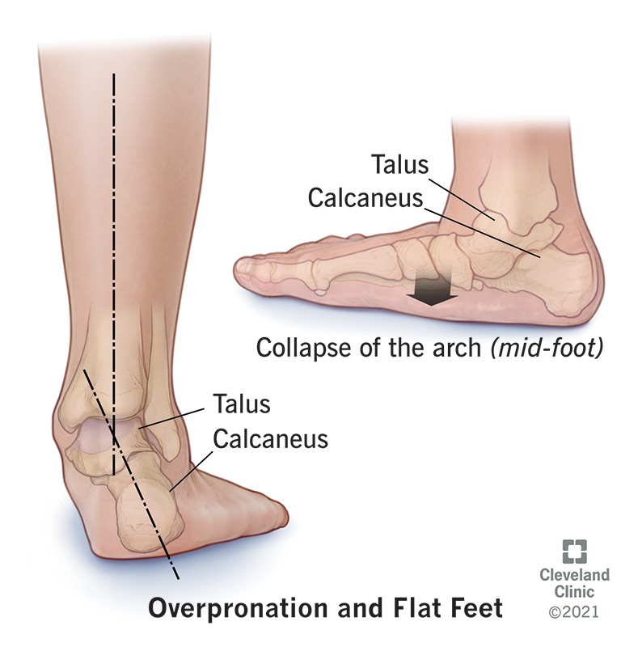

# 개념 (Overview)

## 이론 (Theory)
- **정상 범위의 회내** : 보행 시 발이 지표면과 접촉할 때 일어나는 **적절한 회내(pronation)는 정상**이다. 입각기(stance phase)의 15~25% 지점이 되면 발은 회내전으로부터 벗어난다. 이 시점으로부터 발은 보행주기의 발가락 들림을 위해 견고한 지렛대 역할을 하기 위한 준비에 들어간다.
- **증가된 회내전** : 75%의 체중부하가 될 때까지 발이 견고한 지렛대의 역할로 변환되지 않으면 **증가된 회내전**이 있다고 정의한다.
- 발이 정상이면 발의 궁(arch)에 최대의 체중이 가해져도 견뎌낼 수 있다.
- **발의 기능이 정상이기 위한 조건** :
  - **골격 구조**
  - **인대 기능**
  - **근육과 근막의 기능**

## 핵심 원리 (Core Principle)
- 내측족궁(Medial Longitudinal Arch)의 구조적·기능적 완전성이 정상 보행의 전제조건이다.

## 현상 (Phenomena)
- **내측족궁 무너짐** : 보행 시 **내측족궁(Medial Longitudinal Arch)** 이 과도하게 무너지며 거골(Talus)이 내측 및 하방으로 이동한다.
- **체중부하 시 족저근막(plantar fascia) 긴장**
- **내측족궁 긴장**
- **경골, 비골 내회전**
- **슬개골 내회전**
- **신발 뒤꿈치 바깥쪽 닳음**

## 시각 자료 (Visual Materials)

